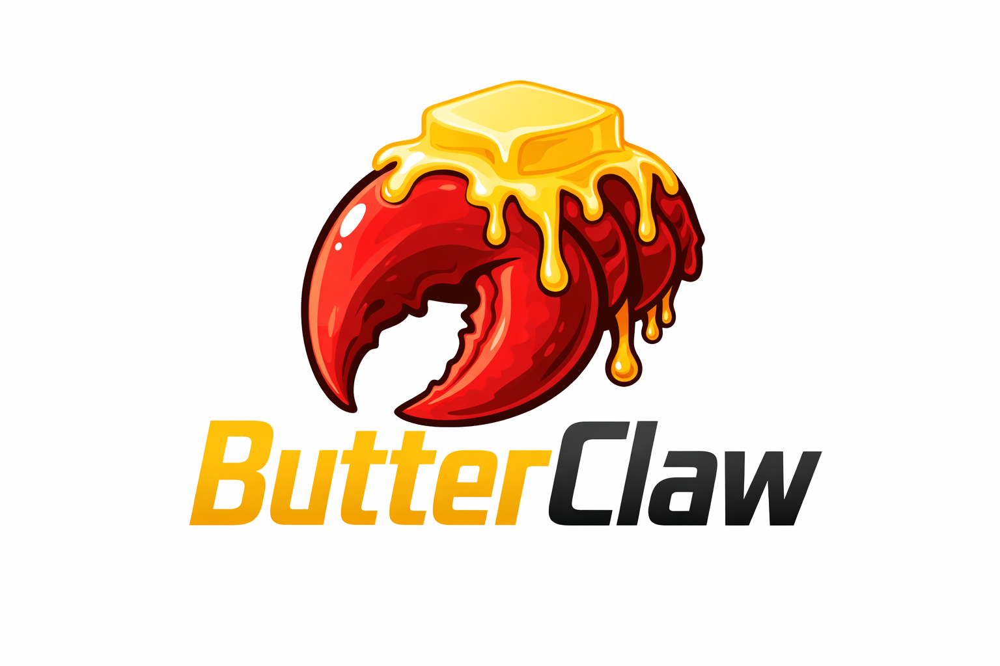

<p align="center">
  
</p>

<h1 align="center">ButterClaw</h1>

<p align="center">
  <strong>AiMe's governed cognitive architecture + OpenClaw's platform infrastructure.</strong><br>
  <em>The brain of one. The reach of the other.</em>
</p>

<p align="center">
  <a href="https://github.com/ai-nhancement/AiMe-public"></a>
  <a href="https://github.com/openclaw/openclaw"></a>
  <a href="LICENSE"></a>
</p>

---

## What Is ButterClaw?

ButterClaw brings a governed cognitive architecture to one of the most popular open-source AI agent platforms on the market.

**[OpenClaw](https://github.com/openclaw/openclaw)** is a production-grade agent platform with 87 messaging channel integrations, multi-agent orchestration, model fallback chains, a plugin SDK, and a full HTTP/WebSocket gateway. It is excellent infrastructure — but it has no cognitive architecture. No user model. No truth separation. No behavioral integrity. No governed initiative. Its persona system is a static markdown file (SOUL.md) that the user edits by hand.

**[AiMe (Amy)](https://github.com/ai-nhancement/AiMe-public)** is a governed cognitive architecture that has been in continuous daily use since November 2025 — built by a single developer. It has an append-only evidence ledger, truth separation with external verification, a six-layer living portrait, governed proactive initiative with absence tiers, behavioral integrity metrics (RIC, SRL, UVRG), significance-scored memory, temporal scoping, and demonstrated value extraction. What it lacked was reach — it ran on a local web UI with no messaging platform support.

**ButterClaw** puts AiMe's brain inside OpenClaw's body.

---

## Why This Exists

AiMe was built around a principle that most AI projects still avoid: **Human-Led, System-Controlled.** The human retains authority. The system governs execution. The model is a subordinate narrator — it does not route, own memory, control initiative, or decide when to speak.

That architecture produces something different from what most agent frameworks deliver. After months of daily use, the system knows who the user is, what matters to them, what concerns are open, and what should be surfaced at the right moment. It references personal details naturally in conversation. It reminds you about your evening medication woven into a goodnight message. It leads with your daughter's birthday before the morning emails. It adjusts its tone based on whether you were up late the night before.

None of that comes from the model. All of it comes from the system.

What AiMe lacked was reach. It ran on a local web UI. No mobile. No messaging platforms. No way for the system to follow you outside the workshop.

OpenClaw solved that distribution problem — 87 messaging platforms, multi-agent support, a plugin SDK, and production-grade infrastructure. But its memory is session transcripts and vector search. Its persona is a static file. Its initiative is a cron scheduler. There is no cognitive layer governing what the system knows, how it learns, or when it should act.

ButterClaw takes the parts each project does best and combines them.

---

## How the Codebases Compare

This is not a claim — it is a comparison of what exists in each codebase as of March 2026. The ButterClaw column tracks what has been ported so far.

| Capability | AiMe | OpenClaw | ButterClaw |
|-----------|------|----------|------------|
| **Append-only evidence ledger** | Immutable SQLite, 3-tier (ledger + UT + VAT), WAL mode | None — session transcripts in JSON DAG | Planned |
| **Truth separation** | UT vs. VAT enforced; WordNet + Wikidata anchors; blocks inference on failure | None | **4-class classification + grounding monitor + importance-weighted filtering** (24 tests) |
| **Living portrait (user model)** | 6 layers: identity, relational graph, concerns, commitments, fingerprint, patterns; temporal decay; concern arcs | SOUL.md — static, user-edited, no auto-learning | Planned |
| **Governed initiative** | ThalamoFrontalLoop: 6 producers, 5 absence tiers, significance gating, spam prevention, preference learning | Cron scheduler with multi-delivery. No significance gating | Planned |
| **Significance scoring** | 3-layer: affect + novelty + resolution + echo; email, event, semantic scorers | None | Planned |
| **Temporal scoping** | Per-fact-class decay (permanent → momentary), half-life math, reaffirmation, windowed retrieval | Optional temporal decay on memory search | Planned |
| **Behavioral integrity** | RIC (5-factor), SRL (4 traits, honesty gate, drift index, 34 tests), UVRG | None | Planned |
| **Value extraction** | Ethos pipeline: 15 values, `demos x significance x resistance x consistency`, no LLM calls | None | Planned |
| **Memory search** | Hybrid RRF fusion (Meilisearch + Qdrant), rolling topic vectors, significance filtering | Embeddings vector search with optional MMR and temporal decay | Inherited from OpenClaw |
| **Context management** | CerebralCortex pipeline with stage-based processing | Pluggable context engine with LLM-powered compaction | Inherited + truth boundary wrapper |
| **Model routing** | 6 governed lanes with rotation | Ordered fallback chain with cooldown, auth-profile-aware | Inherited from OpenClaw |
| **Multi-agent** | Single instance | Subagent spawning with registry, TTL, workspace isolation | Inherited from OpenClaw |
| **Messaging channels** | Local web UI only | **87 platforms**: WhatsApp, Discord, Telegram, Slack, Signal, Matrix, Teams, IRC, iMessage, LINE + 77 more | Inherited from OpenClaw |
| **Gateway API** | FastAPI web server | Full WebSocket + HTTP, OpenResponses-compatible streaming | Inherited from OpenClaw |
| **Security** | Basic | Deep audit framework, per-channel policies, tool approval, command gating | Inherited from OpenClaw |
| **Plugin SDK** | Internal plugin bus | Full extension model: channels, providers, memory, media, search | Inherited from OpenClaw |
| **Relationship model** | The Bond — persistent relational primitive with trust, demonstrated values, integrity over time | None — session-based, not relational | Planned |

**AiMe treats the user-AI interaction as a relationship. OpenClaw treats it as a session. ButterClaw brings the relationship to the platform.**

---

## The Architecture

ButterClaw's goal is to layer AiMe's cognitive pipeline on top of OpenClaw's agent platform:

```
User Input (from any channel: web, WhatsApp, Discord, Telegram, Slack, Teams)
    |
OpenClaw Gateway        -- HTTP/WebSocket transport, channel routing
    |
AiMe CerebralCortex    -- Governed cognitive pipeline
    |
  ├─ Evidence Ledger    -- Append-only, immutable, truth-classified
  ├─ Living Portrait    -- 6-layer user model, updated every turn
  ├─ Significance Gate  -- Score and filter by importance
  ├─ RIC/SRL Check      -- Behavioral integrity verification
  └─ Initiative Gov.    -- Should the system speak? When? Why?
    |
OpenClaw Agent Runtime  -- Model selection, fallback, tool execution
    |
Channel Output          -- Response delivered to originating platform
```

### Memory

- **Evidence Ledger** — Append-only immutable store. Every interaction is recorded with truth classification. User statements are authoritative (User Truth). System claims require grounding (Verifiable Assistant Truth). None of this exists in OpenClaw.
- **Retrieval** — AiMe: hybrid RRF fusion (Meilisearch + Qdrant) with rolling topic vectors and significance filtering. OpenClaw: embeddings-based vector search. ButterClaw will integrate AiMe's retrieval into OpenClaw's pluggable memory backend.
- **Significance Filtering** — AiMe scores every turn with a four-subscale formula. Recent turns are kept verbatim; older turns are filtered by significance. OpenClaw has no equivalent.

### Identity

- **Living Portrait** — AiMe maintains a six-layer evolving model of the user: identity anchors, relational graph, active concerns, commitments, behavioral fingerprint, and pattern recognition. Updated every turn. Persists across sessions and months. Temporal decay ensures stale facts lose confidence. OpenClaw's SOUL.md is a static file with no auto-learning.
- **Behavioral Integrity** — RIC measures groundedness, calibration, transparency, helpfulness, and pressure resistance on every response. SRL tracks honesty, consistency, responsiveness, and self-awareness over time. UVRG extracts demonstrated values from behavioral evidence. OpenClaw has no integrity system.

### Initiative

- **OpenClaw** — Cron scheduler with multi-delivery (announce to channels, webhooks). Jobs run on a timer.
- **AiMe** — Governed initiative pipeline: 6 signal producers (scheduler, email significance, return recognition, identity continuity, third-party presence, context bridge), 5 absence tiers, significance gating, spam prevention, preference learning. The model never decides when to speak — the system does.
- **ButterClaw goal** — Port AiMe's governed initiative into OpenClaw's cron and delivery infrastructure.

### Values

- **Ethos UVRG** — Extracts demonstrated values from real behavioral evidence. `score = demonstrations x significance x resistance x consistency`. 15 tracked values, no LLM calls. Does not exist in OpenClaw.
- **Environmentally Trained Models** — The long-term direction: training models inside their operating environment on trajectories generated from real relationship evidence.

---

## Timeline

| Date | Event |
|------|-------|
| **November 2025** | AiMe development begins |
| **February 2026** | AiMe v2 repository initiated |
| **March 2026** | Living portrait, governed initiative, behavioral integrity, significance scoring, temporal scoping, event graph — all live and in daily use |
| **March 2026** | ButterClaw created — AiMe's cognitive architecture brought to the OpenClaw platform |

AiMe has been in continuous daily use for over four months. The blog posts, essays, and architecture documents are timestamped and publicly available.

---

## Read More

The thinking behind this architecture is documented in detail:

### From the AiMe Project

- **[Project Documentation](https://github.com/ai-nhancement/AiMe-public)** — Full README, architecture docs, vision documents
- **[A Day in the Life with Amy](https://github.com/ai-nhancement/AiMe-public/blob/master/essays/a_day_in_the_life_with_amy.md)** — Real conversations quoted from the evidence ledger showing what daily use looks like
- **[Why the Model Is Not the Product](https://github.com/ai-nhancement/AiMe-public/blob/master/blog/01_why_the_model_is_not_the_product.md)** — The foundational argument
- **[Tools or Collaborators](https://github.com/ai-nhancement/AiMe-public/blob/master/blog/02_tools_or_collaborators.md)** — The fork nobody wants to talk about
- **[Values, Not Rules](https://github.com/ai-nhancement/AiMe-public/blob/master/blog/03_values_not_rules.md)** — Why we cannot prompt our way to trust
- **[The Bond](https://github.com/ai-nhancement/AiMe-public/blob/master/architecture/the_bond.md)** — The relational primitive at the center of the system

### From OpenClaw

- [OpenClaw Repository](https://github.com/openclaw/openclaw)

---

## Status

ButterClaw is in early integration. The AiMe cognitive core is stable and in daily use. OpenClaw's platform infrastructure is being adapted to work inside the governed architecture.

**Phase 1:** Evidence ledger and truth separation integrated into OpenClaw's context engine
**Phase 2:** Living portrait layered on top of SOUL.md — auto-learning user model
**Phase 3:** Governed initiative pipeline wired into OpenClaw's cron and delivery system
**Phase 4:** Messaging channel bridge — cognitive pipeline accessible from all 87 platforms

---

## About

ButterClaw is maintained by [ai-nhancement](https://github.com/ai-nhancement).

AiMe was built by a single developer starting in November 2025. The entire cognitive architecture — pipeline, memory, portrait, initiative, integrity, routing, and all supporting infrastructure — was designed and implemented solo.

> *"The model is not the AI. The model is a component. The system is the intelligence."*
